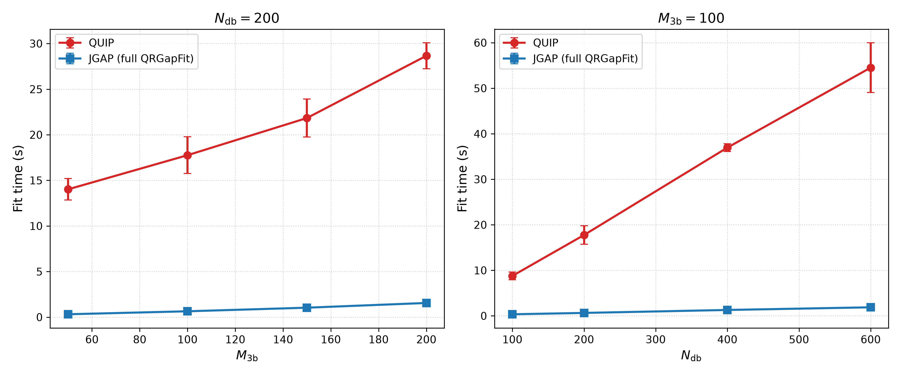
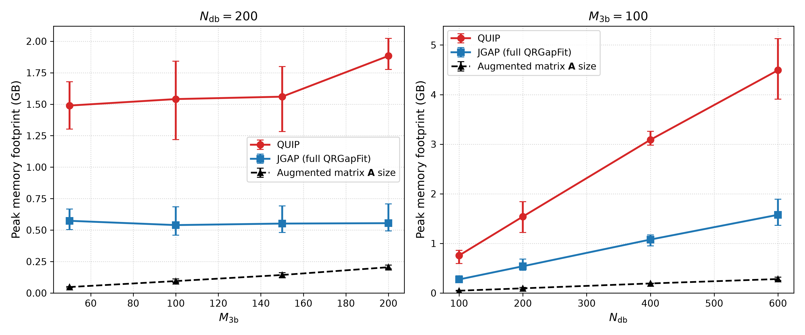
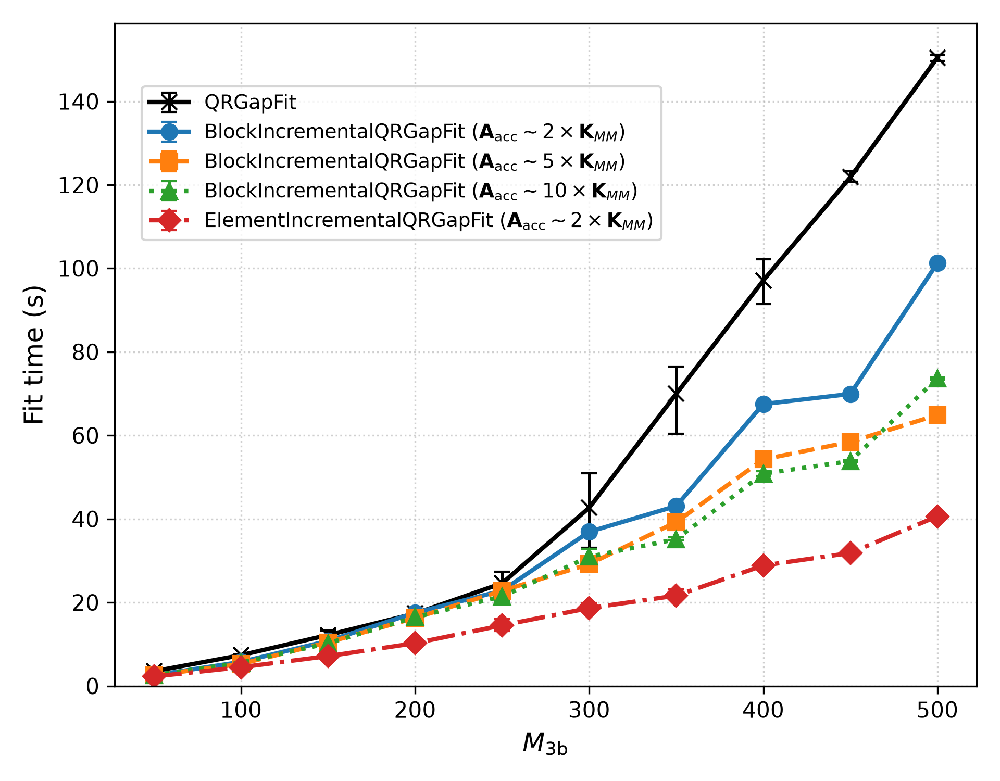
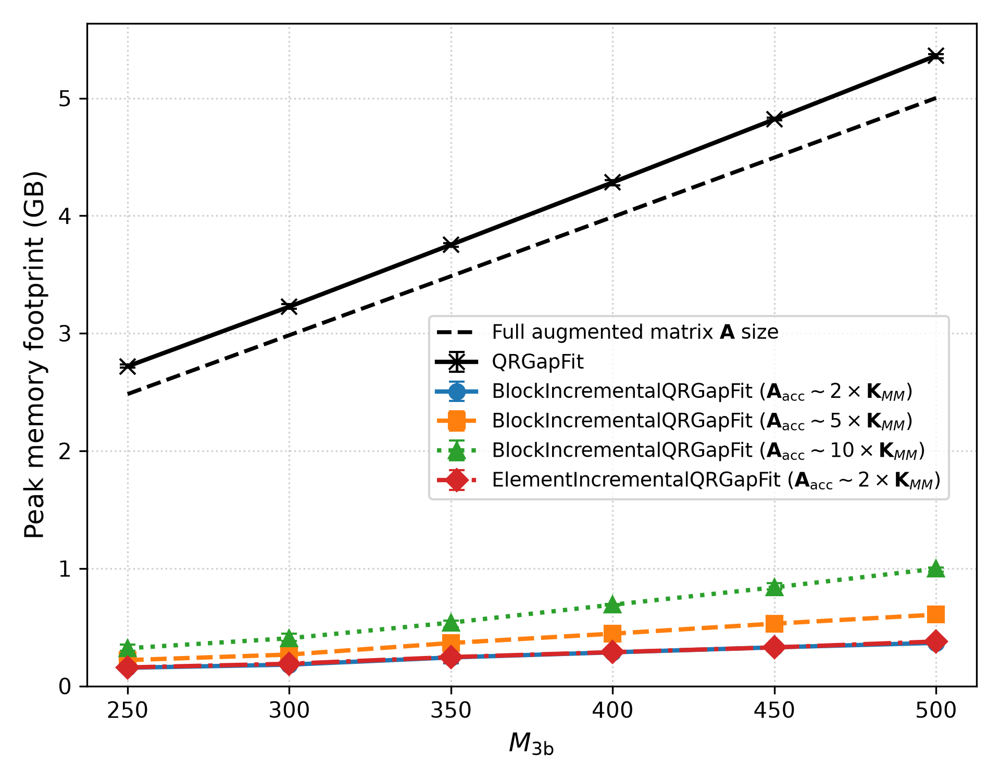

# JGAP

A high-performance C++23 library, command-line toolkit, and Python framework for fitting, tabulating, and evaluating **Gaussian Approximation Potentials (GAP)** and **Tabulated GAP (tabGAP)**.

---

## 1. Quickstart: Python & `pip`

### Installation via `pip`

Install the Python package and ASE calculator directly from PyPI:

```bash
pip install jgap
```

> [!TIP]
> **HPC Clusters & Maximum Performance**: Pre-compiled binary wheels distributed via PyPI target generic CPU architectures for universal portability. On HPC clusters and dedicated compute nodes, compiling `jgap` from source enables hardware-level **`-march=native`** vector extensions (AVX-512, AVX2, FMA). See the **[HPC & Native Compilation Guide](docs/Compilation.md#4-hpc-clusters--marchnative-compilation)**.

> [!NOTE]
> For containerized workflows without local compiler dependencies (Docker / Apptainer `.sif` on HPC clusters), see the **[Apptainer & Container Guide](docs/installation/linux_apptainer.md)**.

### Python & ASE Calculator Example

`jgap` integrates directly with Python and the [Atomic Simulation Environment (ASE)](https://wiki.fysik.dtu.dk/ase/):

```python
import jgap
from jgap.ase import JGAPCalculator
from ase.io import read

# 1. Load training database (custom property names like virial/energy/force supported)
training_data = jgap.read_atoms("train.xyz", virial="virial")  # e.g. virial="dft_virial"

# 2. Fit a standard 2-body + 3-body + EAM GAP potential
params = jgap.StandardGapParams(
    seed=120,
    approx_ram_limit_gb=2.0,
    # Configurable energy (delta) & length scales:
    energy_scale_2b=10.0, length_scale_2b=1.0,
    energy_scale_eam=1.0, length_scale_eam=1.0,
    energy_scale_3b=1.0,  length_scale_3b=1.0,
)
sigmas = jgap.PerConfigTypeRegularizationRules(
    default_sigmas=jgap.PerConfigTypeSigmas(energy=0.001, force=0.05, virials_iso=0.1, virials_aniso=0.02),
    exact_config_type_sigmas={
        "isolated_atom": jgap.PerConfigTypeSigmas(energy=0.0001, force=0.01, virials=0.1),
    },
    config_type_contains_sigmas={
        "liquid": jgap.PerConfigTypeSigmas(energy=0.005, force=0.1, virials_iso=0.2, virials_aniso=0.05),
    },
).determine_for_all(training_data)

jgap.standard_gap_fit("potential.jgap.h5", training_data, sigmas, params)

# 3. Tabulate into fast 3D cubic B-spline table and EAM (.tabgap.h5 and .eam.fs)
jgap.standard_tabulation("potential.jgap.h5", "potential")

# 4. Evaluate using the ASE Calculator
atoms = read("structure.xyz")
atoms.calc = JGAPCalculator("potential.jgap.h5") # Supports .jgap.h5 and .tabgap.h5

energy = atoms.get_potential_energy()
forces = atoms.get_forces()
stress = atoms.get_stress()
```

---

## 2. Compile & Install from Source (C++ Library & CLI)

You can compile and install `jgap` (the C++ shared library, CLI tools, and Python interface) using CMake's unified workflow preset:

```bash
# Configure, build optimized Release targets, and install in a single command
cmake --workflow --preset install
```

> [!NOTE]
> * **Python Virtual Environments**: To install the Python interface into your active virtual environment, configure with:
>   ```bash
>   cmake --preset release -DPython3_EXECUTABLE=$(which python) -DCMAKE_INSTALL_PREFIX=$VIRTUAL_ENV
>   cmake --build --preset install
>   ```
>   *(For Conda environments, use `-DCMAKE_INSTALL_PREFIX=$CONDA_PREFIX`).*
> * **Prerequisites & System Dependencies**: For compiler requirements (C++23 with GCC 15 or Clang 19+), libraries (HDF5, OpenBLAS), package manager setup (macOS, Ubuntu, Conda), and HPC instructions, see the **[Compilation & Installation Guide](docs/Compilation.md)**.

---

## 3. Command-Line Tools

* **Predict Energy & Forces**:
  ```bash
  jgap --predict potential.jgap.h5 input.xyz output.xyz
  ```
* **Tabulate Potential (to EAM `.eam.fs` and tabGAP `.tabgap.h5`)**:
  ```bash
  jgap --tabulate potential.jgap.h5
  ```
* **Convert Legacy QUIP XML to HDF5**:
  ```bash
  jgap_convert potential.xml potential.jgap.h5
  ```

---

## 4. Performance & Benchmarks

> [!IMPORTANT]
> **Mathematical Equivalence**: Given the same set of sparse representative points, JGAP produces regression coefficients identical to QUIP reference fits up to floating-point roundoff errors ($c_\mathrm{JGAP} \approx c_\mathrm{QUIP}$, with cosine similarity $> 1 - 10^{-10}$ and normalized RMSE on average $< 10^{-4}\%$).

All benchmarks below were conducted on an **Apple M2 MacBook** (8 CPU cores, macOS, 8 GB Unified Memory) using the Fe–Ni alloy training database across systematic sweeps over training database size ($N_\mathrm{db}$) and 3-body sparse point count ($M_\mathrm{3b}$). Parallel execution across neighbor lists, descriptor evaluation, and B-spline tabulation is powered by OpenMP (configurable via `export OMP_NUM_THREADS=8`).

### JGAP vs QUIP: Fitting Time & Peak Memory

This comparison benchmarks JGAP's standard in-memory solver (`QRGapFit` / FullQR) against reference QUIP (`gap_fit`). JGAP delivers an **18× – 44× wall-clock speedup** over reference QUIP for linear regression fitting while substantially decreasing peak memory usage. In addition, elemental fitting (`ElementIncrementalQRGapFit`) may improve multi-component alloy fitting times even further by solving lower-order elemental sub-problems independently.

| Fitting Execution Time (s) | Peak Memory Consumption (GB) |
| :---: | :---: |
|  |  |

### Out-of-Core Incremental QR Solvers

Standard GAP training requires storing the full observation design matrix $\mathbf{A} \in \mathbb{R}^{(N_\mathrm{obs} + M) \times M}$ in RAM, creating a severe memory bottleneck for large datasets or high sparse point counts. To overcome this limitation, JGAP introduces novel out-of-core streaming QR fitting techniques:

* **`BlockIncrementalQRGapFit`**: Streams structures in configurable observation blocks $B$, incrementally accumulating Householder transformations into a compact upper-triangular matrix $\mathbf{R} \in \mathbb{R}^{M \times M}$ without ever materializing the full design matrix in RAM.
* **`ElementIncrementalQRGapFit`**: Partitions training data by elemental complexity—solving single-element components first before streaming multi-element configurations—dynamically sizing observation buffers according to an approximate memory target (`approx_ram_limit_gb`). *(Note: in practice, actual peak process memory is higher than this target due to dataset storage, descriptor buffers, and runtime memory overheads).*

| Incremental QR Fit Time Scaling | Incremental QR Peak Memory (RSS) Scaling |
| :---: | :---: |
|  |  |

As shown above, the streaming incremental solvers reduce peak memory consumption by **over 10× – 12×** compared to standard Full QR, allowing large potentials to be fitted on ordinary workstations and laptops with zero loss in mathematical accuracy.

> [!NOTE]
> For detailed theoretical derivations, numerical stability proofs, and extended scaling analyses of these techniques, see the Master's thesis [[1]](#7-references--citations).

---

## 5. LAMMPS Integration

* **EAM Potentials**: The generated `.eam.fs` files can be directly evaluated inside LAMMPS via standard `pair_style eam/fs`.
* **Tabulated GAP Potentials (`.tabgap.h5`)**: Direct evaluation of multi-body B-spline `.tabgap.h5` potentials inside LAMMPS simulations is supported via the external tabGAP LAMMPS package available at **[gitlab.com/jezper/tabgap](https://gitlab.com/jezper/tabgap)**.

---

## 6. Documentation Index

* **[Compilation & Installation Guide](docs/Compilation.md)**: Complete guide on toolchains, dependencies, virtual environments, HPC modules, and CMake presets.
* **[Developer & Extension Guide](docs/Development.md)**: Architectural diagrams, HDF5 serialization mechanisms, adding custom extensions (cutoffs, kernels, potentials), and running tests.
* **[Conventions & Standards](docs/Conventions.md)**: Physical units, memory layout, Voigt stress conventions, and coding style.
* **[Examples Catalog](examples/ReadMe.md)**: Guide to C++ and Python examples, including standalone single-file C++ compilation commands.

---

## 7. References & Citations

If you use **JGAP** in your work, please cite:

* **[1] JGAP**:  
  > J. Baļzins, *Efficient training and tabulation of Gaussian approximation potentials*, Master's thesis (University of Helsinki, 2026) [link will be added after it would be published in [helda.helsinki.fi](https://helda.helsinki.fi)].

If you use **GAP** (Gaussian Approximation Potentials), please cite:

* **[2] GAP**:  
  > A. P. Bartók, M. C. Payne, R. Kondor, and G. Csányi, *Gaussian Approximation Potentials: The Accuracy of Quantum Mechanics, without the Electrons*, Phys. Rev. Letters 104, 136403 (2010), https://doi.org/10.1103/PhysRevLett.104.136403, [APS Link](https://journals.aps.org/prl/abstract/10.1103/PhysRevLett.104.136403).

If you use **tabGAP** (tabulation and tabulated potentials), please cite:

* **[3] tabGAP (Complex Alloys)**:  
  > J. Byggmästar, K. Nordlund, and F. Djurabekova, *Simple machine-learned interatomic potentials for complex alloys*, Phys. Rev. Materials 6, 083801 (2022), https://doi.org/10.1103/PhysRevMaterials.6.083801, https://arxiv.org/abs/2203.08458.

* **[4] tabGAP (Refractory HEAs)**:  
  > J. Byggmästar, K. Nordlund, and F. Djurabekova, *Modeling refractory high-entropy alloys with efficient machine-learned interatomic potentials: Defects and segregation*, Phys. Rev. B 104, 104101 (2021), https://doi.org/10.1103/PhysRevB.104.104101, https://arxiv.org/abs/2106.03369.

---

## 8. License

This project is licensed under the **GNU General Public License v3.0 or later (GPL-3.0-or-later)** — see the [LICENSE](LICENSE) file for details.
