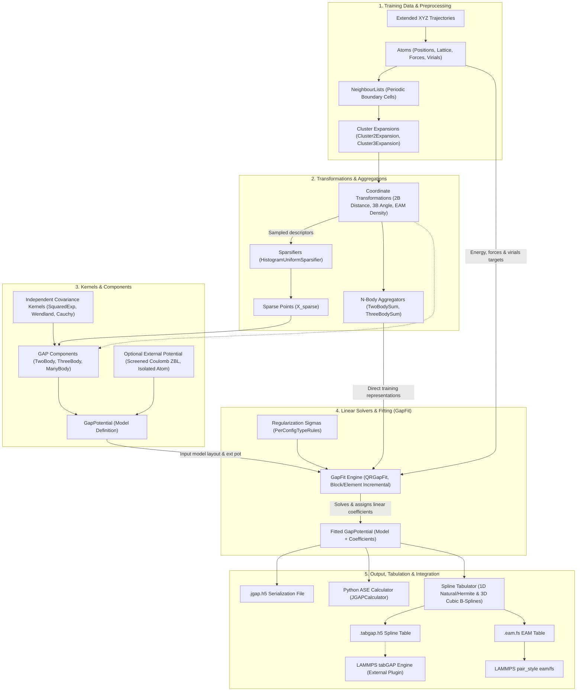

# Developer & Extension Guide

This guide covers the internal architecture of `jgap`, how to run unit tests and validation suites, how the serialization system works, and how to extend the framework with new components.

---

## 1. System Architecture

The following diagram illustrates how atomic representations, cluster expansions, aggregators, kernels, components, external baselines, fitting solvers, and tabulation engines interconnect in `jgap`:



### Architectural Key Concepts
1. **Cluster Expansions & Transformations**: Neighbor lists are expanded into 2-body pairs and 3-body triplets (`Cluster2Expansion`, `Cluster3Expansion`) before applying non-linear coordinate mappings (e.g. `Angle3bTransformation`, `FSGenPairFunction`).
2. **Dual Path for Transformed Representations**:
   * A subset of transformed descriptors is sampled by `HistogramUniformSparsifier` to generate the representative basis set (**Sparse Points** $X_s$).
   * During fitting, transformed descriptors from all training configurations are gathered via **N-Body Aggregators** (`TwoBodySum`, `ThreeBodySum`) and fed directly into the design matrix assembly.
3. **Independent Kernels & Component Assembly**: Covariance kernels (`SquaredExpKernel`, `WendlandKernel`, `CauchyKernel`) are purely mathematical objects defined independently of descriptors. A **GAP Component** combines a specific transformation, its sparse basis set $X_s$, and a covariance kernel.
4. **`GapPotential` as Both Input and Output of Fitting**:
   * **As Input**: `GapPotential` defines the model architecture (the collection of components, kernels, sparse points) and optionally an `optional_external_potential` (such as ZBL `ScreenedCoulombPotential` and `IsolatedAtomPotential`).
   * **Residual Fitting**: During `GapFit`, the external potential evaluates baseline contributions, which are subtracted from DFT reference targets ($y_{\text{target}} = y_{\text{DFT}} - y_{\text{ext}}$).
   * **As Output**: The linear solver (`QRGapFit` or low-memory streaming variants) solves the regularized system and assigns the resulting coefficients ($c_j$ / $\boldsymbol{\alpha}$) directly into the components of the `GapPotential`.
5. **External Simulation Engines**:
   * `.eam.fs` files run directly in LAMMPS via standard `pair_style eam/fs`.
   * Multi-body `.tabgap.h5` tables run inside LAMMPS via the external plugin repository [gitlab.com/jezper/tabgap](https://gitlab.com/jezper/tabgap).

---

## 2. Codebase Organization

The source code in `src/jgap/` maintains a clean separation between **core abstractions** and **concrete implementations**:

* **`core/`**: Foundational mathematics, interfaces, and physics data primitives:
  * `atomic/`: `Atoms`, `Lattice`, `Species`, `Virials`, neighbor lists, cluster expansions (`Cluster2Expansion`, `Cluster3Expansion`).
  * `cutoff/`: Cutoff abstract base class (`CutoffFunction`).
  * `kernels/`: Covariance kernel base interface (`Kernel`).
  * `potentials/`: Base `Potential` class, `GapPotential`, `TabGapPotential`, `CompositePotential`.
  * `sparsification/`: Sparsification base interface (`Sparsifier`).
  * `splines/`: Spline interpolation interfaces (`Spline`, `Grid`).
  * `tabulation/`: Multi-grid tabulation data structures (`TabulationData`, `TabulationParams`).
  * `transform/`: Coordinate transform interfaces (`TwoBodyTransformation`, `ThreeBodyTransformation`, `EamPairFunction`, `NBodyAggregator`).
  * `fit/`: Abstract linear solver interface (`GapFit`).
* **`impl/`**: Concrete algorithms and component implementations:
  * `cutoff/`: `CosCutoff`, `PerriotPolynomialCutoff`, `WendlandFunction`.
  * `kernels/`: `SquaredExpKernel`, `CauchyKernel`, `WendlandKernel`.
  * `fit/gap/`: `QRGapFit`, `BlockIncrementalQRGapFit`, `ElementIncrementalQRGapFit`.
  * `transform/`: 2-body (`PairDistanceTransformation`, `CoordinationTransformation`), EAM functions (`FSGenPairFunction`, `CoscutoffPairFunction`, `PolycutoffPairFunction`, `SplinePairTransformation`), 3-body (`Angle3bTransformation`, `CosTransformation`, `CutoffJK3bTransformation`, `Distances3bTransformation`, `MeamTransformation`), aggregators (`TwoBodySum`, `ThreeBodySum`).
  * `sparsification/`: `HistogramUniformSparsifier`, `FromFileSparsifier`.
  * `potentials/`: `ScreenedCoulombPotential` (ZBL), `IsolatedAtomPotential`, `SplinePairPotential`.
  * `splines/`: 1D/3D Cubic B-splines, Hermite, Natural cubic splines.
* **`serialization/`**:
  * Polymorphic HDF5 serialization infrastructure (`SerializationNode`, `SerializationRegistry`, and component serializers).
* **`io/`**:
  * Potential loader (`loadPotential`), QUIP XML converter (`QuipXmlConverter`), tabGAP I/O.
* **`utils/`**:
  * High-level fitting driver (`standardGapFit`), parameter structs (`StandardGapParams`, `StandardTabulationParams`).
* **`pybind/`**:
  * Python C-extension interface (`PyJGAP.cpp`).

### Shared Library Requirement
`jgap_lib` is built strictly as a **shared library (`SHARED`)**. The dynamic serialization registry and polymorphic casting across module boundaries rely on shared-library symbol visibility.

---

## 3. How Serialization Works Overall

`jgap` uses a decoupled, non-intrusive polymorphic serialization system built on top of HDF5 (via HighFive). Potential objects and mathematical components can be saved to and loaded from `.jgap.h5` files without embedding file-format logic inside the core physics classes.

### Architectural Primitives

1. **`SerializationNode`**:
   An abstraction layer over HDF5 groups and datasets. It provides type-safe methods to read and write attributes, strings, scalar datasets, and multidimensional arrays:
   ```cpp
   node.writeAttribute("name", "SquaredExpKernel");
   node.writeDataSet("length_scale", kernel.length_scale);
   ```

2. **`Serialization<TBase>` Interface**:
   Each serializable class hierarchy implements a serializer deriving from `Serialization<TBase>`:
   ```cpp
   class MyPotentialSerialization : public Serialization<Potential> {
   public:
       bool serialize(const ValuePtr<Potential>& obj, SerializationNode& node) const override;
       ValuePtr<Potential> deserialize(const SerializationNode& node) const override;
   };
   ```

3. **`SerializationRegistry<TBase>` & Dynamic Self-Registration**:
   Serializers register themselves dynamically into the registry at library load time using the `REGISTER_SERIALIZATION` macro:
   ```cpp
   REGISTER_SERIALIZATION(MyPotentialSerialization, Potential);
   ```
   When saving a potential:
   ```cpp
   SerializationRegistry<Potential>::serialize(my_pot, "potential.jgap.h5");
   ```
   The registry iterates through all registered serializers for `Potential`. The serializer matching the concrete dynamic type serializes the node. During deserialization, the registry inspects the `"name"` attribute on the HDF5 group to instantiate and populate the corresponding derived object.

---

## 4. How to Add Extensions

### 1. Adding a New Cutoff Function
1. Inherit from `CutoffFunction` in `src/jgap/impl/cutoff/`:
   ```cpp
   #include "jgap/core/cutoff/CutoffFunction.hpp"

   class MyCutoff : public CutoffFunction {
   public:
       MyCutoff(double cutoff, double width);
       double evaluate(double r) const override;
       double derivative(double r) const override;
       double getCutoff() const override;
       MyCutoff* clone() const override;
   };
   ```
2. Create `MyCutoffSerialization.cpp` in `src/jgap/serialization/cutoff/`:
   - Implement `serialize` and `deserialize` storing parameters to HDF5.
   - Register via `REGISTER_SERIALIZATION(MyCutoffSerialization, CutoffFunction);`.

### 2. Adding a New Covariance Kernel
1. Inherit from `Kernel<Dim, DerivDim>` in `src/jgap/impl/kernels/`:
   ```cpp
   #include "jgap/core/kernels/Kernel.hpp"
   ```
2. Implement covariance calculation, distance functions, and gradients.
3. Add serialization in `src/jgap/serialization/kernels/` with `REGISTER_SERIALIZATION(..., Kernel<Dim, DerivDim>)`.

### 3. Adding a New Potential Type
1. Inherit from `Potential` in `src/jgap/impl/potentials/`:
   ```cpp
   #include "jgap/core/potentials/Potential.hpp"

   class CustomPotential : public Potential {
   public:
       AtomicQuantity calculateEnergy(const Atoms& atoms) const override;
       Cutoffs getCutoffs() const override;
       CustomPotential* clone() const override;
       void fillTables(TabulationData& table) const override;
   };
   ```
2. Implement `calculateEnergy` to compute total energy, forces (`AtomicQuantity.forces`), and virials (`AtomicQuantity.virials`).
3. Implement `fillTables` to evaluate the potential over tabulation grids for fast spline export.
4. Implement and register its serializer in `src/jgap/serialization/potentials/` with `REGISTER_SERIALIZATION(CustomPotentialSerialization, Potential)`.

### 4. Exposing Extensions to Python
In `src/pybind/PyJGAP.cpp`:
1. Bind the new class using `py::class_<T>`.
2. Ensure methods returning C++ objects convert safely to Python-managed instances or NumPy arrays.

---

## 5. Testing & Validation Guide

`jgap` utilizes a two-tier verification strategy.

### Tier 1: Unit Tests (Fast Local Feedback)
* Framework: GoogleTest (`jgap_tests`).
* Location: `test/unit/` (covers math primitives, atomic structures, neighbor lists, cutoffs, splines, and HDF5 round-trips).
* **Execution**:
  ```bash
  # Configure and run via Developer workflow preset:
  cmake --workflow --preset dev

  # Or build and run directly:
  cmake --build build/debug --target jgap_tests
  ./build/debug/jgap_tests

  # Run a targeted test filter:
  ./build/debug/jgap_tests --gtest_filter="TestTabGapPotential.*"
  ```

### Tier 2: Automated Validation Suite (Scientific Accuracy)
* Location: `test/validation/`.
* Verifies numerical accuracy against external references (QUIP XML baselines, tabGAP HDF5 tables, and LAMMPS outputs).
* Includes physical elemental property testing ($a_0, B, C_{ij}, E_{\text{vac}}^f, E_{\text{coh}}$) via ASE + `elastic`.
* **Execution**:
  1. Extract reference datasets (if not already extracted):
     ```bash
     unzip -q test/resources/validation.zip -d test/resources/
     ```
  2. Run the validation suite workflow preset:
     ```bash
     cmake --workflow --preset validation
     ```
  3. Or run using CTest labels:
     ```bash
     ctest --test-dir build/validation -L validation --output-on-failure
     ```
